# springboot103抗疫物资管理系统 / SpringBoot103 Anti-epidemic Materials Management System


> 更多毕设项目可跳转至项目导航栏检索：[毕设项目](http://sysadmin.3vfree.vip)，需要联系博主v：xq-lucky311，q：1047944234. 备注：项目咨询
注：由于前端项目太大，仅上传了后端代码，未包含前端代码...

## 项目简介  
基于SpringBoot+MyBatisPlus+Shiro的抗疫物资管理系统，实现物资全生命周期管理。系统包含物资分类管理、出入库管理、公告发布、用户权限控制等功能，采用分层架构设计，支持高效数据操作和权限控制。

## 特征介绍  
- **权限控制**：集成Shiro实现RBAC权限模型，支持注解式权限验证（@IgnoreAuth）  
- **高效开发**：MyBatisPlus实现零SQL单表操作，内置分页插件和代码生成器  
- **分层架构**：严格区分Controller/Service/DAO层，实体层含Model/View/VO多维度设计  
- **文件管理**：独立FileController处理文件上传，配置静态资源访问路径  
- **接口文档**：符合RESTful规范，通过Interceptor实现统一请求处理  
- **工具集成**：内置MD5加密、百度AI工具、HttpClient等常用工具类  

## 代码结构 
```
src/
├── main/
│ ├── java/
│ │ ├── com/
│ │ │ ├── SpringbootSchemaApplication.java # 启动类
│ │ │ ├── annotation/ # 权限注解
│ │ │ │ ├── APPLoginUser.java
│ │ │ │ ├── IgnoreAuth.java
│ │ │ ├── config/ # 配置类
│ │ │ │ ├── InterceptorConfig.java
│ │ │ │ ├── MybatisPlusConfig.java
│ │ │ ├── controller/ # 接口层
│ │ │ │ ├── CommonController.java
│ │ │ │ ├── GonggaoxinxiController.java
│ │ │ ├── dao/ # 数据访问层
│ │ │ │ ├── CommonDao.java
│ │ │ │ ├── GonggaoxinxiDao.java
│ │ │ ├── entity/ # 数据模型
│ │ │ │ ├── GonggaoxinxiEntity.java
│ │ │ │ ├── model/ # 业务模型
│ │ │ │ │ ├── WuzichukuModel.java
│ │ │ │ │ ├── WuzifenleiModel.java
│ │ │ │ ├── view/ # 视图模型
│ │ │ │ │ ├── WuzichukuView.java
│ │ │ │ ├── vo/ # 值对象
│ │ │ │ │ ├── WuzichukuVO.java
│ │ │ ├── interceptor/ # 拦截器
│ │ │ │ ├── AuthorizationInterceptor.java
│ │ │ ├── service/ # 服务层
│ │ │ │ ├── GonggaoxinxiService.java
│ │ │ │ ├── impl/ # 实现类
│ │ │ │ │ ├── GonggaoxinxiServiceImpl.java
│ │ │ ├── utils/ # 工具类
│ │ │ │ ├── MD5Util.java
│ │ │ │ ├── BaiduUtil.java
│ ├── resources/
│ │ ├── admin/ # 后台管理页面
│ │ ├── front/ # 前台页面
│ │ ├── mapper/ # MyBatis映射
│ │ │ ├── GonggaoxinxiDao.xml
│ │ ├── application.yml # 主配置
│ │ ├── static/upload/ # 上传目录

## 使用说明
**推荐浏览器**：谷歌浏览器  
**后台地址**：http://localhost:8080/springboot5j0wf/admin/dist/index.html  
**管理员账号**：abo / abo  
**前台地址**：http://localhost:8080/springboot5j0wf/front/index.html  

**数据库配置**（修改application.yml）：
```yaml
url: jdbc:mysql://127.0.0.1:3306/springboot5j0wf?useUnicode=true&characterEncoding=utf-8
username: root
password: 123456 # 修改为实际密码
```

# 项目实际截图：
## 登录：
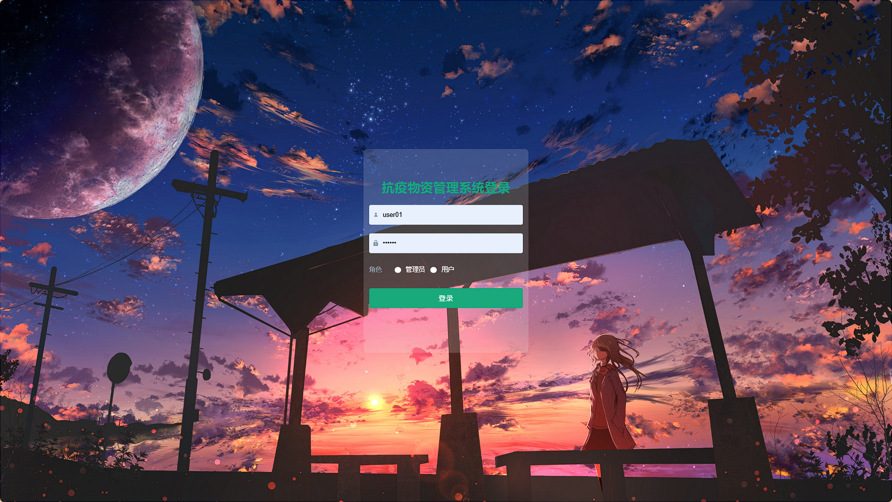

## 前台：
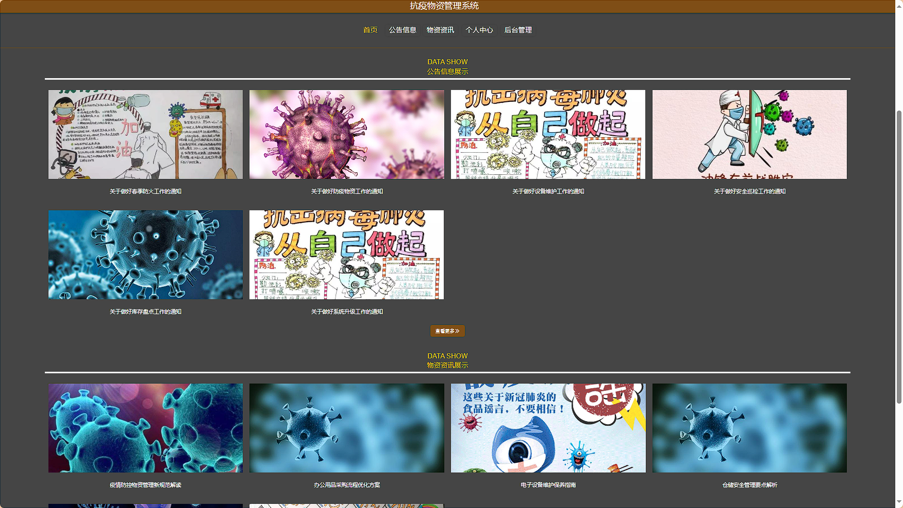

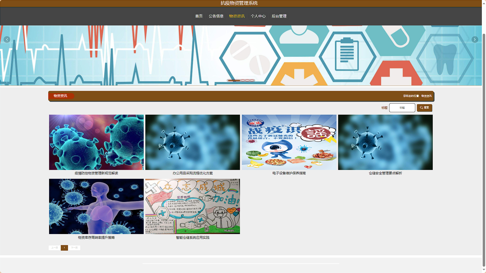
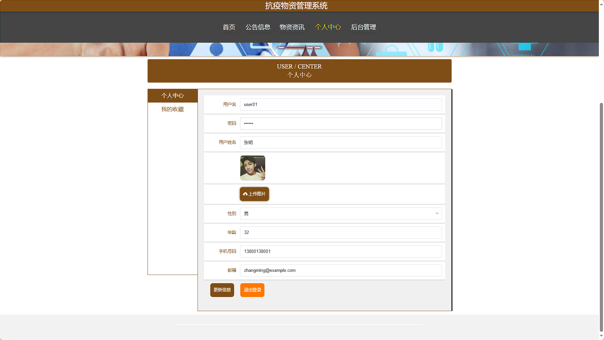
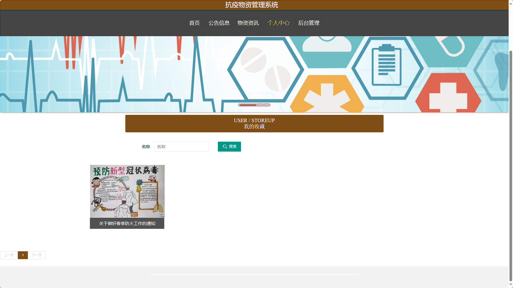

## 后台：
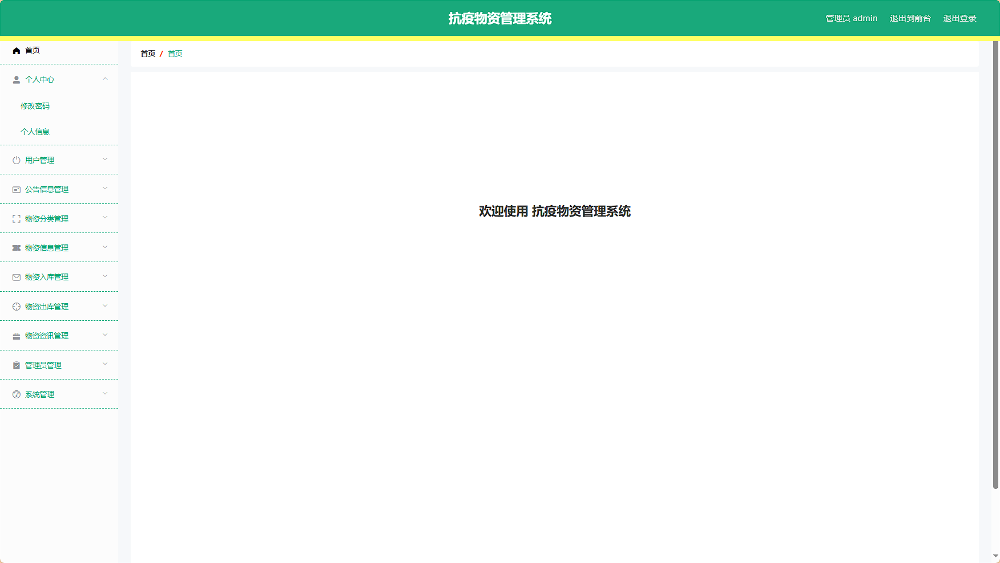
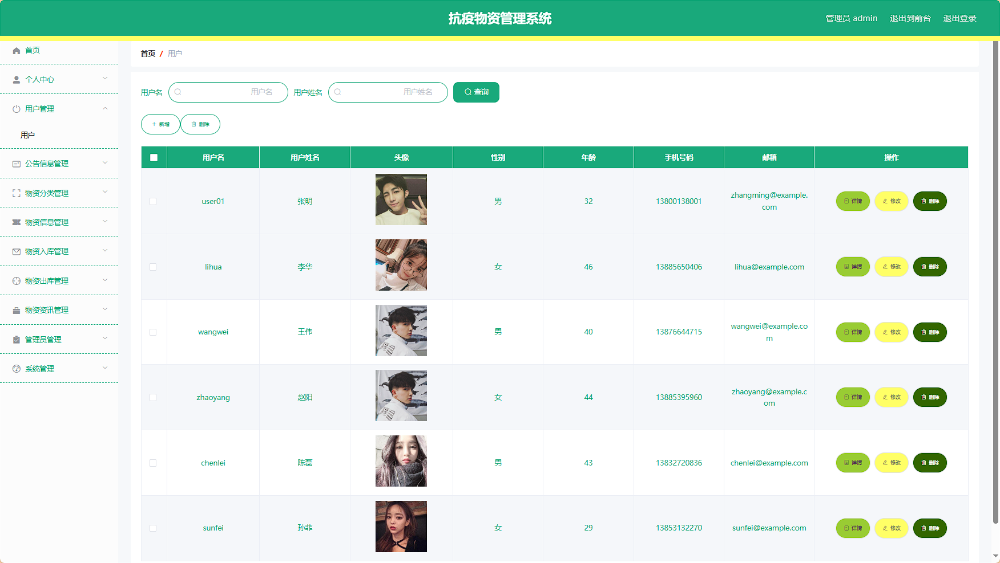
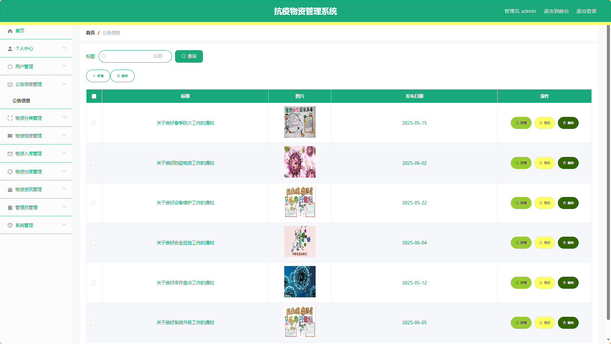
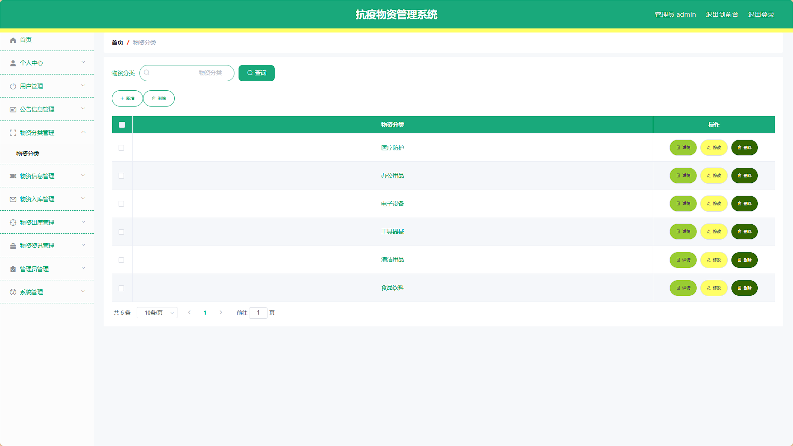
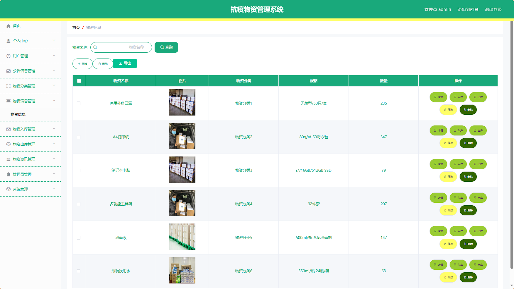

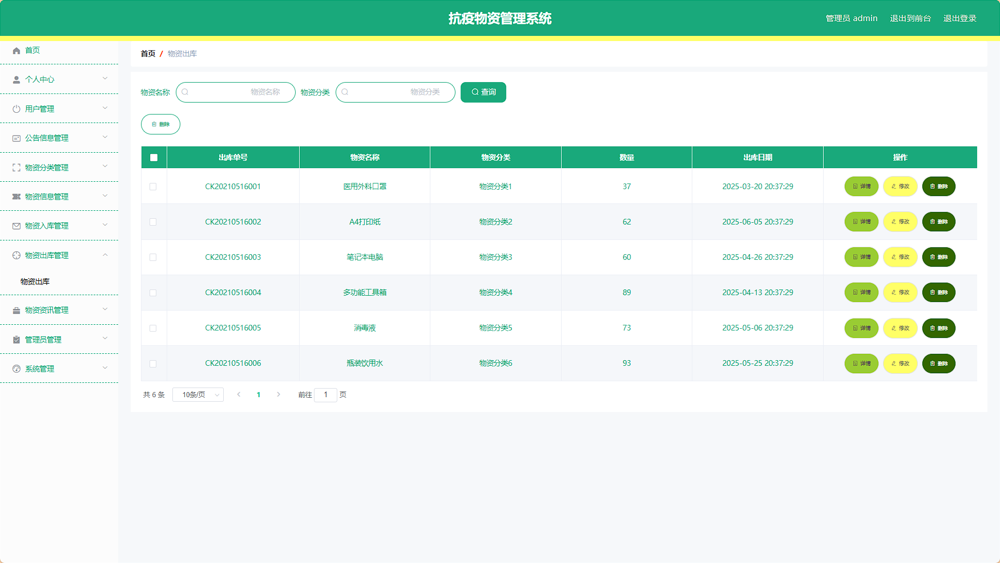
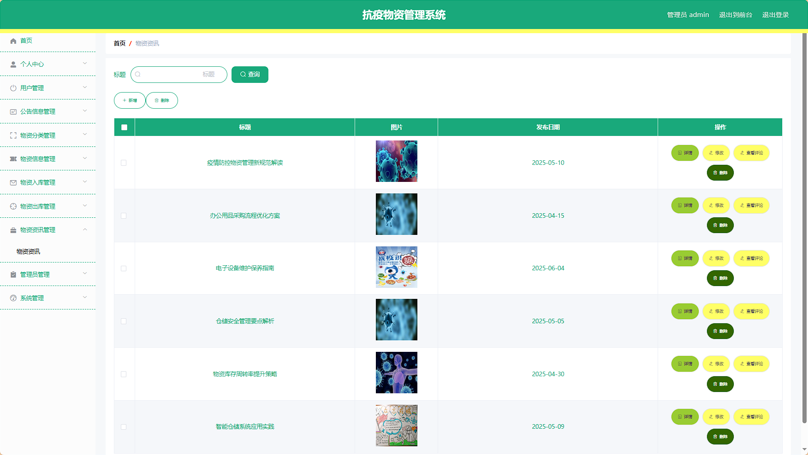
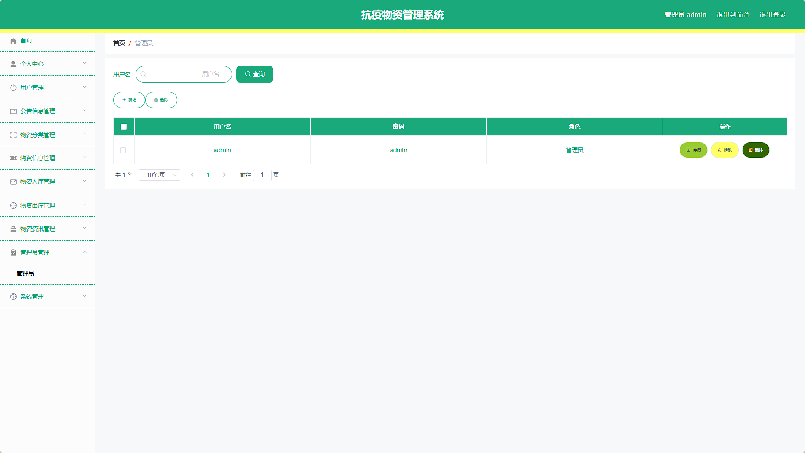

> 等等...

# 精选项目导航 & 快速部署工具
## 项目资源一站直达
- ​**访问项目导航站**：[点击进入](http://sysadmin.3vfree.vip)**快速检索所需项目名称**
- ​**技术栈全覆盖**：Java/SSm/Spring Boot/小程序等主流技术方案
- ​**配套资源**：每个项目均提供部署文档 + 演示视频（附效果截图）

### ▌导航站预览


### ▌工具界面预览


## 捐赠
> 博主将持续更新Java全栈开发项目，包含ssm，springboot，前后端分离系统等项目。
> 此外如果您够宽裕，请博主喝杯咖啡吧！捐赠将用于服务器维护与开源社区建设，感谢您的认可！
> 如需更多Java相关项目毕设3000+，有其他项目需求，sql文件等可联系博主v:xq-lucky311

---